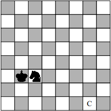

# A Király és huszár kihívás

Adott egy sakktábla, amelyre egy huszárt és egy királyt helyezünk a lenti ábrán látható módon. 

A feladat az, hogy valamelyik figurával a megjelölt
mezőre lépjünk. Csak azzal a figurával lehet lépni a sakklépéseknek megfelelően, amelyik éppen ütésben van a másik által.
